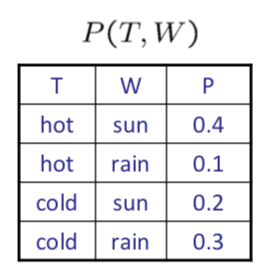
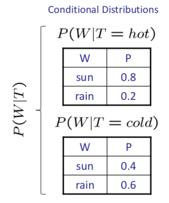

## Probability

- [Uncertainty](#uncertainty)

- [Random Variables](#random-variables)

- [Probability Distributions](#probability-distributions)

- [Joint Distributions](#joint-distributions)

- [Probabilistic Models](#probabilistic-models)

- [Marginal Distributions](#marginal-distributions)

- [Conditional Probabilities](#conditional-probabilities)

- [Conditional Distributions](#conditional-distributions)

- Normalization Trick

  

[Back](../README.md)

[Next topic: Bayes' Nets](bayes_nets.md)

---

### Uncertainty

- Obeserved variables (evidence)
- Unobsereved variables
- Model

---

### Random Variables

- A random variable is some aspect of the world about which we have uncertainty
- Denote random variables with capital letters

---

### Probability Distributions

A distribution is a TABLE of probabilities of values

Must have: $\forall x \; P(X=x)\geq 0$ and $\sum_x P(X=x)=1$

---

### Joint Distributions

A joint distribution over a set of random variables: $X_1,X_2,...,X_n$ specifies a real numbr for each assignment:

$P(X_1=x_1,X_2=x2,...X_n=x_n) \equiv P(x_1,x_2,...x_n)$

$P(T,W)$:

[table 1](table-1)

Size of distribution if **n** variables with domain size **d**: $\bold {d^n}$

---

### Probabilistic Models

A probabilistic model is a joint distribution over a set of random variables

---

### Marginal Distributions

- Marginal distributions are **sub-tables** which **eliminate variables**
- Maginalization (summing out): combine collapsed rows by adding

---

### Conditional Probabilities

$P(a|b)$ denotes the probability of $a$ given $b$, we have

$\Large P(a|b)=\frac{P(a,b)}{P(b)}$

For example, for table 1: 

$\large P(W=s|T=c)=\frac{P(W=s,T=c)}{P(T=c)}=\frac{P(W=s,T=c)}{P(W=s,T=c)+P(W=r,T=c)}=\frac{0.2}{0.5}=0.4$

The **chain rule**:

$\large P(x_1,x_2,...,x_n)=\prod_{i}P(x_i|x_1...x_{i-1})$

For example,

$\large P(x_1,x_2,x_3)=P(x_1)P(x_2|x_1)P(x_3|x_1,x_2)$

---

### Conditional Distributions

Conditional distributions are probability distributions over some variables given fixed values of others

---

[Next topic: Bayes' Nets](bayes_nets.md)